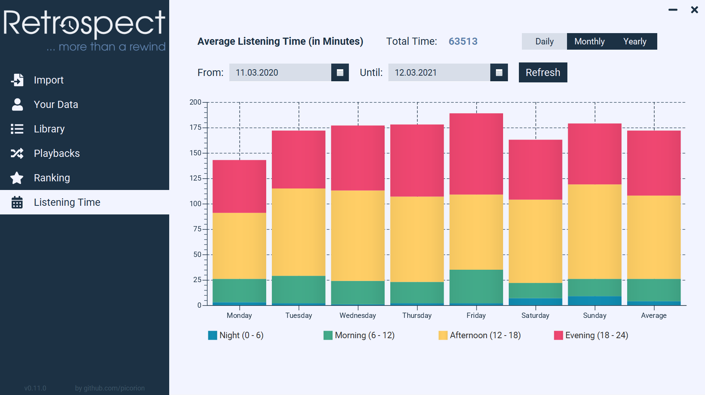
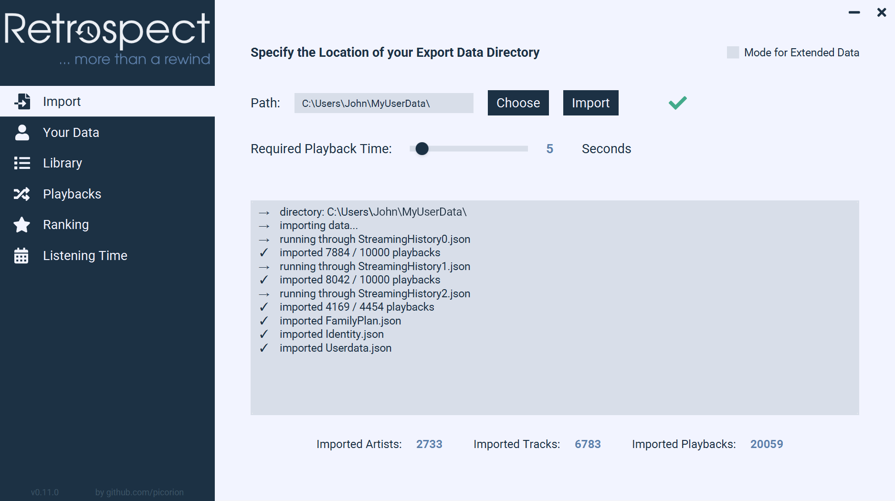

## About

Retrospect is a small java-based tool for visualizing and analyzing Spotify usage data. No connection to an account is
necessary, but the necessary data must be requested manually before it can be imported into Retrospect. The analyses are
performed exclusively offline, only for the display of the profile picture internet is needed.

Have fun trying it out and exploring your listening habits.

## Features

- Complete control over your data, all analyses are run offline
- Overview of user data like your address or profile picture
- Collection of all listened artists and songs
- View of listening history
- Ranking of your most heard artists and songs by listening time and number of playbacks
- Analysis of your listening times by day, month and year
- Additional io.github.picorion.analysis for extended usage data (must be requested separately)
- Decide on the minimum listening time for songs to be considered

## Download

If you prefer a classical download, you can do so via the [releases tab](https://github.com/picorion/Retrospect/releases).

A Java installation is required, see the respective releases for the supported versions.

## Usage

**Step 1, obtain your usage data**

- **Usual Usage Data**
    - First you need to request your user data, therefore visit the
      [Spotify Privacy Settings](https://www.spotify.com/de/account/privacy/)
    - After receiving the data extract the ZIP file
    - To understand the several files view [this article](https://support.spotify.com/us/article/understanding-my-data/)
- **Extended User Data**
    - Includes playbacks exceeding the last year and other data
    - Needs to be requested by mail
    - For more info check the second part
      of [this article](https://support.spotify.com/us/article/understanding-my-data/)

**Step 2, import and usage**

- After obtaining the data you can import the extracted folder
    - Paste the path in of the folder into the text field or choose it using the button
    - Modify the minimal required playback time if you want to exclude shorter playbacks
    - Activate the mode for extended data if you have some (forgets previous imports)
    - Click import and wait till the import finishes
- Navigate through Retrospect and explore your data
    - Your Data: Shows user data like the address, the username etc.
    - Library: Collection of all artists and songs you have heard
    - Playbacks: Listing of all available playbacks
    - Ranking: Most listened artists and songs by time or number of plays
    - Listening Time: Visualization of your listening habits by days, months and years
    - Extended Data: Distribution of songs and podcasts as well as devices used

For some more information check out the [FAQ](doc/FAQ.md)

*View after an import of usual usage data*
